# Cognitive Biases in Decision-Making

**Examining the influence of cognitive biases on decision-making processes to improve awareness and enhance critical thinking.**

[](https://github.com/ungaaaabungaaa/cognitive-biases-decision-making/actions/workflows/ci.yml)


This project treats every cognitive bias as a *measurable deviation from a normative model* and studies it three ways:

1. **Formal models** of the biases (prospect theory, anchoring-and-adjustment, biased Bayesian updating, base-rate neglect, miscalibration), implemented as a small Python library.
2. **Agent-based simulations** that reproduce the classic experimental findings, and quantify how much evidence-based *debiasing techniques* help.
3. **A browser experiment** (seven landmark tasks, ten minutes) that measures a person's own susceptibility and debriefs each bias with the technique that counters it.

<p align="center">
  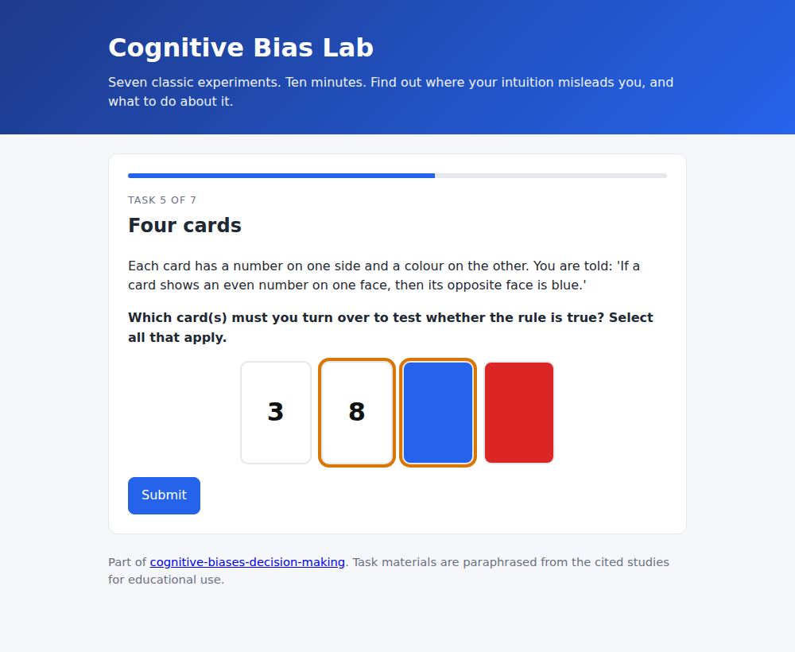
  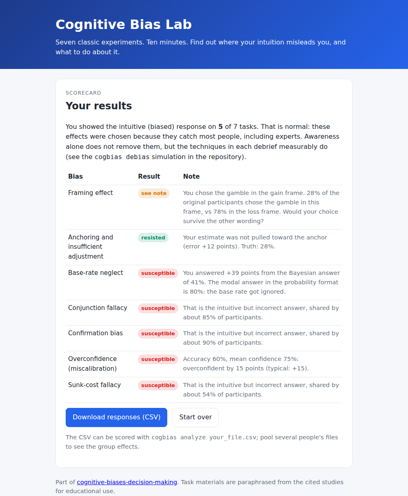
</p>

---

## Contents

- [Why this matters](#why-this-matters)
- [Background](#background)
- [What is in the repository](#what-is-in-the-repository)
- [Results](#results)
- [Quick start](#quick-start)
- [The experiment](#the-experiment)
- [Project structure](#project-structure)
- [References](#references)

## Why this matters

Decisions in medicine, law, finance and public policy are made by people whose judgement is systematically, predictably biased. The same doctor recommends surgery more often when survival is stated as "90% survive" than as "10% die". Judges' sentences follow a number rolled on dice. Two people shown the same mixed evidence walk away more convinced of opposite conclusions. These are not failures of intelligence or effort; they are properties of how fast, intuitive cognition works.

Awareness alone does not fix them: knowing about the Müller-Lyer illusion does not make the lines look equal. What does help are *procedures* that force the slow, deliberate system to check the fast one, and those procedures can be tested. This repository builds the models, runs the experiments, and measures the fixes.

## Background

### Two systems

<p align="center">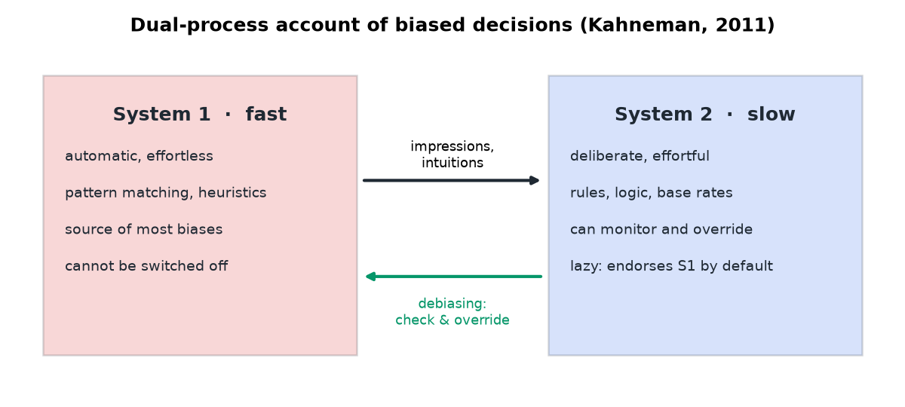</p>

Kahneman's dual-process account: **System 1** produces impressions automatically and is the source of most biases; **System 2** can monitor and override, but is lazy and usually endorses what System 1 suggests. Every debiasing technique in this project is a way of getting System 2 to engage.

### The map of biases

The Cognitive Bias Codex groups the ~190 named biases by the problem they solve for the mind: too much information, not enough meaning, the need to act fast, and what to remember.

<p align="center">
  <a href="https://commons.wikimedia.org/wiki/File:Cognitive_bias_codex_en.svg">
    
  </a><br>
  <sub><i>Cognitive Bias Codex</i> by John Manoogian III (design) and Buster Benson (categories), via Wikimedia Commons, CC BY-SA 4.0.</sub>
</p>

This project focuses on the twelve biases with the strongest evidence and the largest consequences for decisions, and builds quantitative models for five of them. The full catalogue with definitions, mechanisms, consequences, debiasing strategies and primary references is in [`docs/BIAS_CATALOGUE.md`](docs/BIAS_CATALOGUE.md).

| Category | Biases |
|---|---|
| Prospect theory / reference dependence | Framing effect*, Loss aversion*, Sunk-cost fallacy, Status-quo bias |
| Heuristics of judgement | Anchoring*, Base-rate neglect*, Conjunction fallacy, Availability |
| Belief formation | Confirmation bias* |
| Metacognition | Overconfidence*, Dunning-Kruger effect, Hindsight bias |

<sub>* has a quantitative model in `cogbias.models` and a simulated paradigm in `cogbias.simulation`.</sub>

### Prospect theory

Most of the choice biases follow from a single model. Outcomes are evaluated relative to a reference point; the value function is concave for gains, convex for losses, and about twice as steep for losses (loss aversion); and probabilities are weighted non-linearly, so small chances are over-weighted.

<p align="center">
  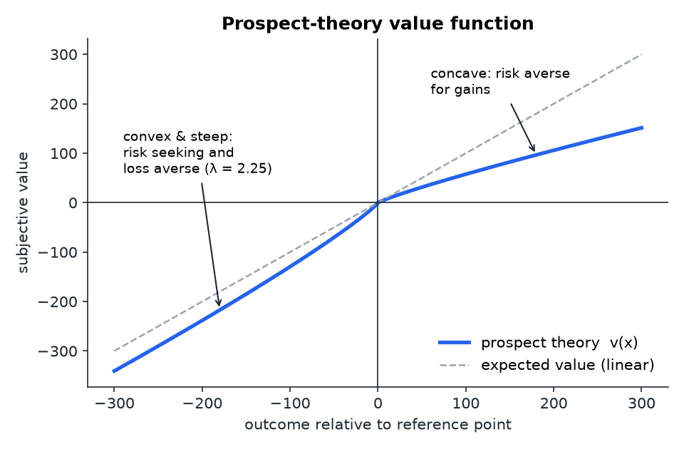
  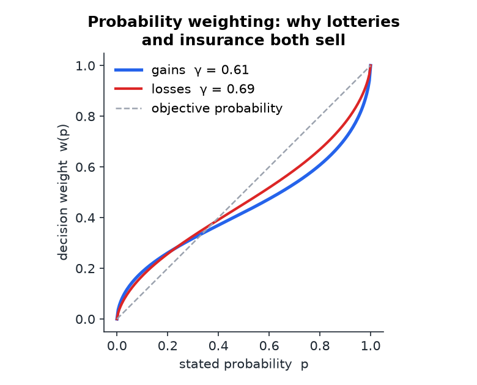
</p>

<p align="center">
  <a href="https://commons.wikimedia.org/wiki/File:Prospect_Theory_Graph.svg"></a>
  <a href="https://commons.wikimedia.org/wiki/File:Wason_selection_task_cards.svg"></a><br>
  <sub>Left: the canonical prospect-theory value function (Wikimedia Commons, CC BY-SA 4.0). Right: Wason's four-card selection task, the classic demonstration of confirmation bias (Wikimedia Commons).</sub>
</p>

## What is in the repository

| Layer | Module | What it does |
|---|---|---|
| Catalogue | `cogbias.catalogue` | 12 biases: definition, mechanism, classic demo, consequences, debiasing, references |
| Models | `cogbias.models` | Cumulative prospect theory, anchoring-and-adjustment, Bayesian vs confirmation-biased updating, base-rate neglect, calibration metrics |
| Simulation | `cogbias.simulation` | Heterogeneous agent populations run through the classic paradigms (Asian disease, wheel of fortune, cab problem, mixed evidence, calibration quiz) |
| Analysis | `cogbias.analysis` | Effect sizes and tests that work identically on simulated and human data: framing effect, anchoring index, polarisation, base-rate error, Brier score |
| Debiasing | `cogbias.debiasing` | Five interventions from the literature, expressed as parameter changes and evaluated on the same population |
| Experiment | `web/`, `cogbias quiz` | Seven-task self-assessment in the browser or the terminal, with debriefs and CSV export |
| Figures | `cogbias.figures` | Regenerates every figure in `docs/images` |

## Results

All numbers below are reproducible with `cogbias simulate --n 2000 --seed 42` and `cogbias debias --n 2000 --seed 42`.

### The models reproduce the classic effects

<p align="center">
  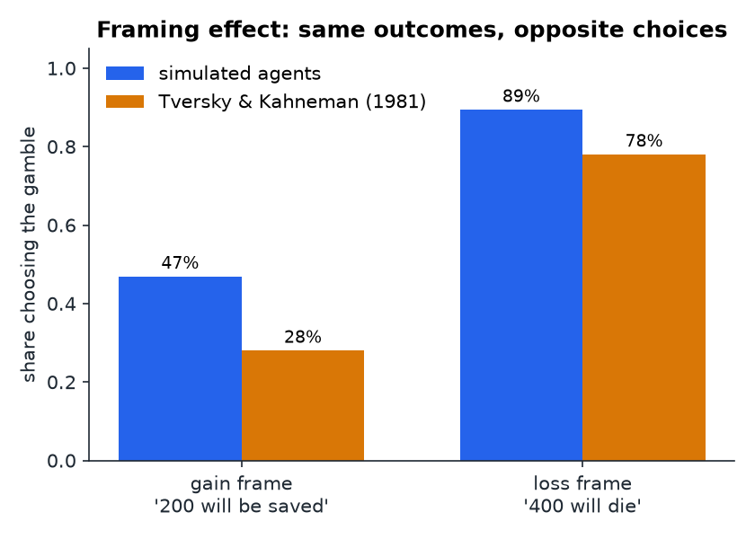
  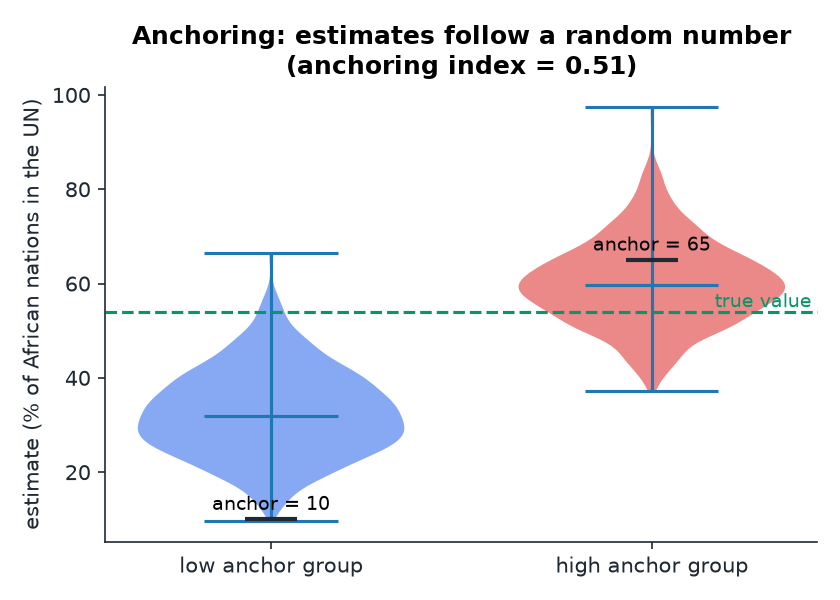
</p>
<p align="center">
  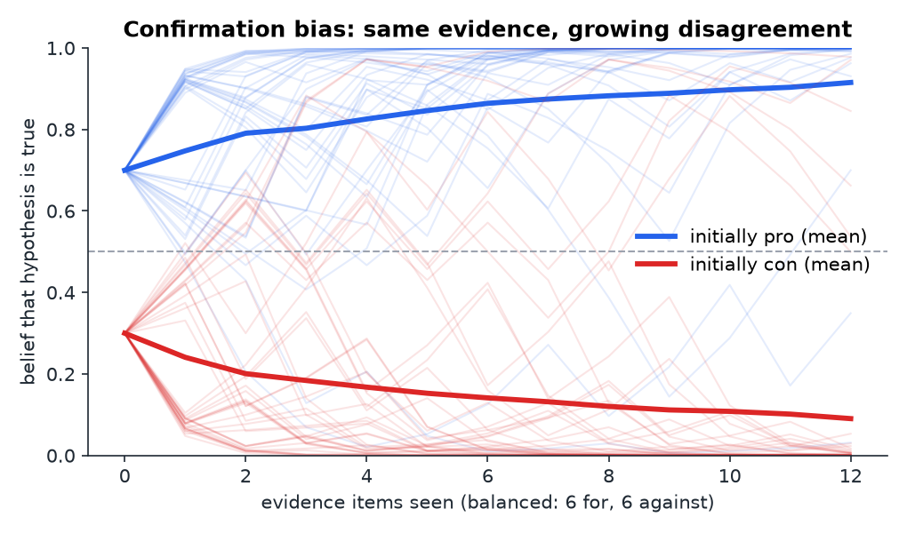
  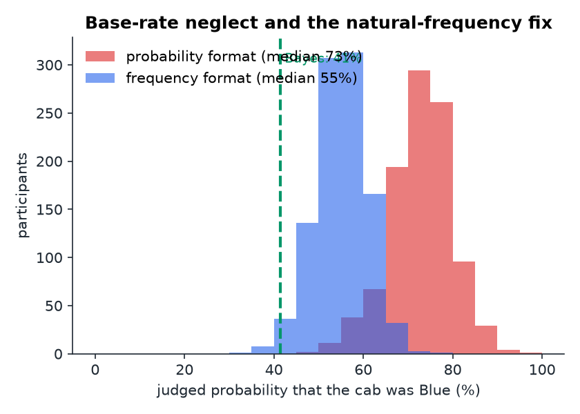
</p>
<p align="center">
  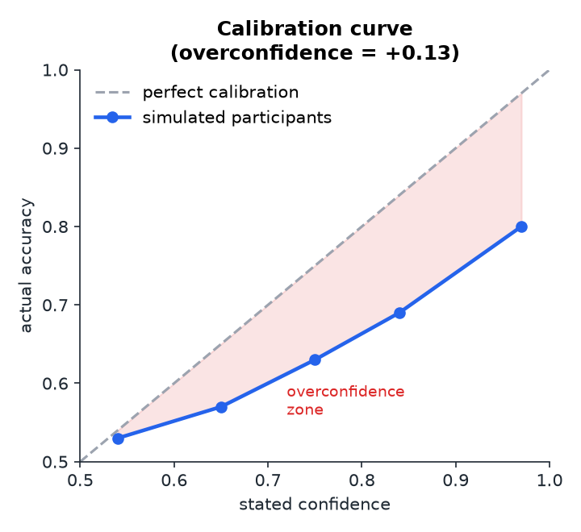
</p>

| Effect | Original finding | Simulated population | Rational population |
|---|---|---|---|
| Framing: chose the gamble, gain vs loss frame | 28% vs 78% | 47% vs 89% | no difference |
| Anchoring index (Jacowitz & Kahneman) | ≈ 0.50 | 0.50 | 0.00 |
| Polarisation after identical evidence | positive (Lord et al.) | +0.43 | 0.00 |
| Cab problem, judged P(Blue), Bayes = 41% | modal answer 80% | median 73% | 41% |
| Overconfidence (confidence − accuracy) | +0.10 to +0.20 | +0.13 | 0.00 |

The "rational" population uses the same paradigms with unbiased parameters and shows none of the effects, which confirms that the biases come from the cognitive parameters and not from the tasks.

### Evidence-based techniques cut each bias roughly in half

<p align="center">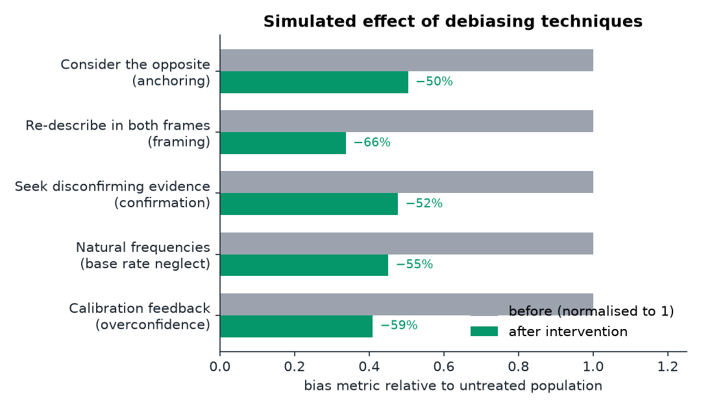</p>

| Technique | Targets | Reduction |
|---|---|---|
| Consider the opposite (list reasons the anchor is too high *and* too low) | anchoring | −50% |
| Re-describe every option in both a gain and a loss frame | framing | −66% |
| Seek disconfirming evidence, weight it by diagnosticity | confirmation bias | −52% |
| Present base rates as natural frequencies ("out of 1,000 people") | base-rate neglect | −55% |
| Calibration feedback and pre-mortems | overconfidence | −59% |

Methodology, model equations, parameter sources and limitations: [`docs/METHODOLOGY.md`](docs/METHODOLOGY.md).

## Quick start

```bash
git clone https://github.com/ungaaaabungaaa/cognitive-biases-decision-making.git
cd cognitive-biases-decision-making
pip install -e ".[dev]"
pytest                          # 17 tests: models, simulations, scoring
```

```bash
cogbias catalogue               # list the biases
cogbias catalogue anchoring     # everything about one bias
cogbias simulate --n 2000       # run every paradigm on a simulated population
cogbias simulate --profile rational
cogbias debias                  # before/after for each intervention
cogbias analyze data/sample_responses.csv   # score any CSV (simulated, quiz or web export)
cogbias figures                 # regenerate docs/images
cogbias quiz --out me.csv       # take the experiment in the terminal
```

Use the library directly:

```python
from cogbias import models

# A loss-averse person turns down a coin flip that wins $150 / loses $100 (EV = +$25)
models.prospect_utility([150, -100], [0.5, 0.5])      # -> -24.2  (negative: rejected)

# The cab problem: Bayes says 41%; a typical answer treats the 15% base rate as if it were 50%
models.bayesian_update(0.15, likelihood_ratio=4)       # -> 0.41
models.base_rate_neglect_posterior(0.15, 4, neglect=0.9)  # -> 0.78

# Same balanced evidence, opposite conclusions
b = 0.7
for lr in [3, 1/3] * 6:
    b = models.confirmation_biased_update(b, lr, confirmation=0.5)   # -> 0.97
```

## The experiment

Open [`web/index.html`](web/index.html) in any browser (no server or build step; nothing is uploaded). Seven tasks, each a paraphrase of a landmark study, with random assignment to conditions for the between-subjects designs:

| Task | Bias | Source |
|---|---|---|
| The outbreak | Framing | Tversky & Kahneman (1981) |
| The wheel of fortune | Anchoring | Tversky & Kahneman (1974) |
| The hit-and-run cab | Base-rate neglect | Kahneman & Tversky (1972); Gigerenzer & Hoffrage (1995) |
| Linda | Conjunction fallacy | Tversky & Kahneman (1983) |
| Four cards | Confirmation bias | Wason (1968) |
| How sure are you? | Overconfidence | Lichtenstein & Fischhoff (1977) |
| Two ski trips | Sunk-cost fallacy | Arkes & Blumer (1985) |

Each debrief shows the participant's answer against the original study's numbers, explains the mechanism, and gives the technique that counters it. Responses download as a CSV that `cogbias analyze` scores; pool several files to see the group-level effects.

<p align="center">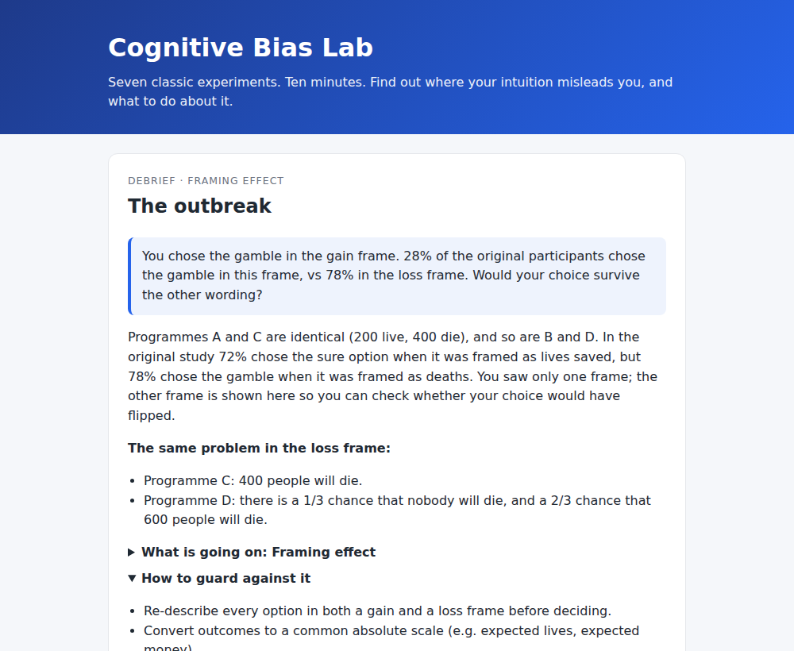</p>

## Project structure

```
src/cogbias/          library (catalogue, models, simulation, analysis, debiasing, figures, cli)
experiments/tasks/    the seven tasks as JSON: single source of truth for the web app, the terminal quiz and the tests
web/                  browser experiment (index.html, app.js, styles.css, generated tasks.js)
data/                 sample_responses.csv, a simulated dataset in the export format
docs/                 BIAS_CATALOGUE.md, METHODOLOGY.md, images/
scripts/              build_web_tasks.py, build_docs.py, generate_sample_data.py
tests/                pytest suite
```

## References

- Kahneman, D. (2011). *Thinking, Fast and Slow*. Farrar, Straus and Giroux.
- Kahneman, D., & Tversky, A. (1979). Prospect theory: An analysis of decision under risk. *Econometrica*, 47, 263–291.
- Tversky, A., & Kahneman, D. (1974). Judgment under uncertainty: Heuristics and biases. *Science*, 185, 1124–1131.
- Tversky, A., & Kahneman, D. (1981). The framing of decisions and the psychology of choice. *Science*, 211, 453–458.
- Tversky, A., & Kahneman, D. (1983). Extensional versus intuitive reasoning: The conjunction fallacy. *Psychological Review*, 90, 293–315.
- Tversky, A., & Kahneman, D. (1992). Advances in prospect theory: Cumulative representation of uncertainty. *Journal of Risk and Uncertainty*, 5, 297–323.
- Wason, P. C. (1968). Reasoning about a rule. *Quarterly Journal of Experimental Psychology*, 20, 273–281.
- Lord, C. G., Ross, L., & Lepper, M. R. (1979). Biased assimilation and attitude polarization. *JPSP*, 37, 2098–2109.
- Gigerenzer, G., & Hoffrage, U. (1995). How to improve Bayesian reasoning without instruction. *Psychological Review*, 102, 684–704.
- Jacowitz, K. E., & Kahneman, D. (1995). Measures of anchoring in estimation tasks. *PSPB*, 21, 1161–1166.
- Mussweiler, T., Strack, F., & Pfeiffer, T. (2000). Overcoming the inevitable anchoring effect. *PSPB*, 26, 1142–1150.
- Arkes, H. R., & Blumer, C. (1985). The psychology of sunk cost. *OBHDP*, 35, 124–140.
- Nickerson, R. S. (1998). Confirmation bias: A ubiquitous phenomenon in many guises. *Review of General Psychology*, 2, 175–220.
- Larrick, R. P. (2004). Debiasing. In *Blackwell Handbook of Judgment and Decision Making*, 316–338.

Full per-bias reference lists: [`docs/BIAS_CATALOGUE.md`](docs/BIAS_CATALOGUE.md).

## Image credits

Figures in `docs/images/` are generated by this project (`cogbias figures`) and screenshots of the web experiment. The Cognitive Bias Codex, prospect-theory graph and Wason cards are embedded from Wikimedia Commons under their respective Creative Commons licences; click each image for its file page and attribution.

## License

MIT. See [LICENSE](LICENSE).
